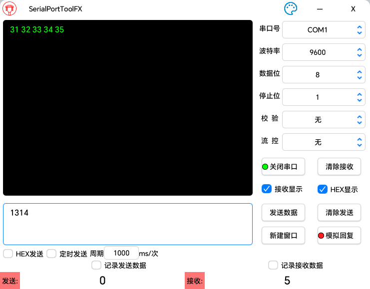
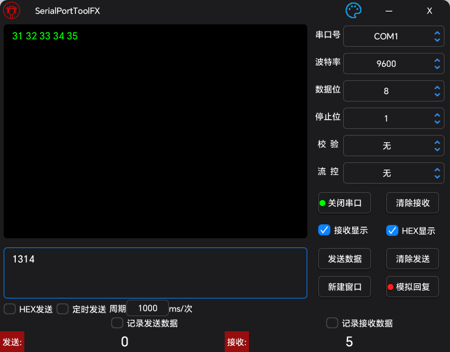

# SerialPortToolFX

## 概述

一个跨平台开源串口调试工具,使用java编写

## 软件界面

### 亮色主题



### 暗色主题



**注意:计数清0,只需在对应的数字上鼠标左键单击即可**

## 依赖

- [lombok](https://github.com/projectlombok/lombok)
- [javafx](https://github.com/openjdk/jfx)
- [atlantafx](https://github.com/mkpaz/atlantafx)
- [jSerialComm](https://github.com/Fazecast/jSerialComm)
- [gson](https://github.com/google/gson)
- [commons-codec](https://github.com/apache/commons-codec)
- [commons-text](https://github.com/apache/commons-text)

## 特性

- 跨平台
- 统计串口收发数据的字节数(最大值:9223372036854775807)
- 支持串口数据持久化(保存在根目录下的logs文件夹中)
- 实时更新串口列表,新增(移除)串口无需重启软件
- 支持使用ASCII和HEX收发数据
- 支持多窗口(窗口关闭自动释放串口资源)
- **支持串口数据模拟回复(需正确配置json文件)**
- 使用ASCII发送数据时支持使用转义字符(例如 \r \n \t...)
- 收到串口数据后可以设置是否进行显示
- 支持串口数据的显示方式**HEX**/**ASCII**

## 串口模拟回复使用说明

### 简短描述:

​	根据收到的串口信息,基于json配置文件中预先设定好的数据进行回复

### json基础配置示例:

```json
{
  "encode": "HEX",
  "packSize": "13",
  "delimiter": ""
}
```

### json文件配置要求和说明:

1. json只能有一层,不可以有多层
2. json的键值对都是字符串类型
3. json中的encode用于指示json文件中编码格式
    - 目前可供选择的参数(不区分大小写)有 **HEX  ASCII**
    - 如果encode 指定为  HEX  则下文中的键值对都以16进制进行解码
    - 如果encode 指定为  ASCII则下文中的键值对都以ASCII进行解码
4. json文件中的packSize和delimiter用于指定串口消息的完整度判断方式
    - packSize表示用数据包的长度来判断消息完整度
    - delimiter表示用特定符号来判断消息完整度
    - **如果同时指定了packSize 和 delimiter  那么delimiter将会被忽略 除非 packSize的内容不正确(非数字)**
    - **packSize 和 delimiter 不能都为空**
5. 如果使用串口结束符来作为判断标准,则内容中最好不要出现结束符,否则会导致模拟回复功能失效

### 以下是一些json文件的配置示例:

1. ASCII+数据包大小

   ```json
   {
     "encode": "ASCII",
     "packSize": "5",
     "delimiter": "",
     "abcde":"ABCDE",
      "12345":"12345"
   }
   ```

2. ASCII+结束符

   ```json
   {
     "encode": "ASCII",
     "packSize": "",
     "delimiter": "\r\n",
     "A\r\n":"B\r\n",
      "AAAA\r\n":"BAAA\r\n"
   }
   ```

3. HEX+数据包大小

   ```json
   {
     "encode": "HEX",
     "packSize": "5",
     "delimiter": "",
     "F1 F2 F3 F4 F5":"01 02 03 04 05",
     "F0 F2 F3 F4 F5":"01 02 03 04 05"
   }
   ```

4. HEX+结束符

   ```json
   {
     "encode": "HEX",
     "packSize": "",
     "delimiter": "0D 0A",
     "01 02 0D 0A":"01 02 0D 0A",
     "01 03 0D 0A":"01 03 05 0D 0A"
   }
   ```
   
   ## 编译打包
   
   ### 环境要求
   
   - java22
   - gradle(对应java版本)
   
   ### 执行指令
   
   ```powershell
   gradle clean
   gradle jpackageimage
   ```
   
   

