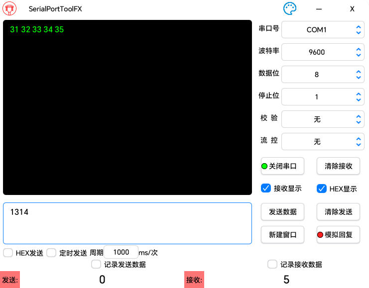
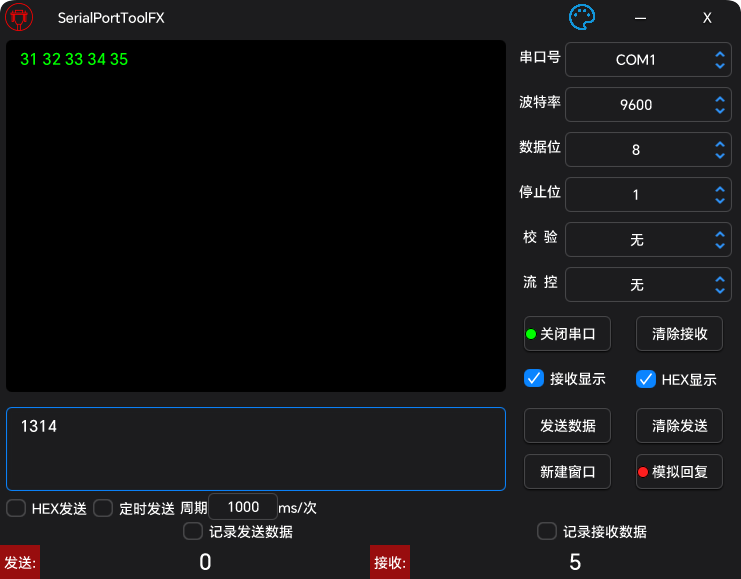

# SerialPortToolFX

## 概述

SerialPortToolFX 是一个跨平台的开源串口调试工具，使用 JavaFX 构建。它旨在提供一个用户友好的界面，方便开发者调试和管理串口通信。

## 软件界面

### 亮色主题



### 暗色主题



## 功能特性

- **实时串口列表更新**：自动检测并显示可用的串口设备。
- **数据格式支持**：支持 ASCII 和 HEX 格式的串口数据收发。
- **数据统计**：统计收发数据的字节数，方便分析。(清空计数需要在对应的数字上鼠标单击即可)
- **数据持久化**：支持将串口通信数据保存到文件。(需要勾选对应的选择按钮)
- **多窗口支持**：允许同时打开多个串口通信窗口。
- **模拟回复**：收到指定的数据后会将预设的数据用以回复(需要正确配置json文件并且加载)

## 依赖

- [lombok](https://github.com/projectlombok/lombok)
- [javafx](https://github.com/openjdk/jfx)
- [atlantafx](https://github.com/mkpaz/atlantafx)
- [jSerialComm](https://github.com/Fazecast/jSerialComm)
- [gson](https://github.com/google/gson)
- [commons-codec](https://github.com/apache/commons-codec)
- [commons-text](https://github.com/apache/commons-text)

## 串口模拟回复JSON文件说明

### JSON基础配置示例:

```json
{
  "encode": "HEX",
  "packSize": "13",
  "delimiter": ""
}
```

### JSON文件配置要求和说明:

1. json的键值对都是字符串类型
2. json只能有一层,不可以有多层
3. json中的encode用于指示json文件中编码格式
    - 目前可供选择的参数(不区分大小写)有 **HEX  ASCII**
    - 如果encode 指定为  HEX  则下文中的键值对都以16进制进行解码
    - 如果encode 指定为  ASCII则下文中的键值对都以ASCII进行解码
4. json文件中的packSize和delimiter用于指定串口消息的完整度判断方式
    - packSize表示用数据包的长度来判断消息完整度
    - delimiter表示用特定符号来判断消息完整度
    - **如果同时指定了packSize 和 delimiter  那么delimiter将会被忽略 除非 packSize的内容不正确(非数字)**
    - **packSize 和 delimiter 不能都为空**
5. 如果使用串口结束符来作为判断标准,则内容中最好不要出现结束符,否则会导致模拟回复功能失效

### 以下是一些JSON文件的配置示例:

1. ASCII+数据包大小

   ```json
   {
     "encode": "ASCII",
     "packSize": "5",
     "delimiter": "",
     "abcde":"ABCDE",
      "12345":"12345"
   }
   ```

2. ASCII+结束符

   ```json
   {
     "encode": "ASCII",
     "packSize": "",
     "delimiter": "\r\n",
     "A\r\n":"B\r\n",
      "AAAA\r\n":"BAAA\r\n"
   }
   ```

3. HEX+数据包大小

   ```json
   {
     "encode": "HEX",
     "packSize": "5",
     "delimiter": "",
     "F1 F2 F3 F4 F5":"01 02 03 04 05",
     "F0 F2 F3 F4 F5":"01 02 03 04 05"
   }
   ```

4. HEX+结束符

   ```json
   {
     "encode": "HEX",
     "packSize": "",
     "delimiter": "0D 0A",
     "01 02 0D 0A":"01 02 0D 0A",
     "01 03 0D 0A":"01 03 05 0D 0A"
   }
   ```
   
   ## 编译打包
   
   ### 环境要求
   
   - java22
   - gradle(对应java版本)
   
   ### 执行指令
   
   ```powershell
   gradle clean
   gradle jpackageimage
   ```
   
   

